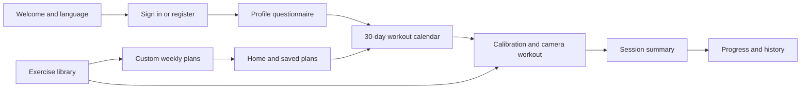

<p align="center">
  
</p>

<h1 align="center">Tri Force</h1>

<p align="center"><strong>Sức Mạnh • Kỷ Luật • Bứt Phá</strong><br>
An Android workout companion with on-device pose tracking, personalized plans, and progress tracking.</p>

<p align="center">
  <a href="README.vi.md">Tiếng Việt</a> ·
  <a href="#getting-started">Getting started</a> ·
  <a href="docs/ARCHITECTURE.md">Architecture</a> ·
  <a href="CONTRIBUTING.md">Contributing</a>
</p>

Tri Force uses CameraX and MediaPipe Pose Landmarker to follow body movements through the phone camera, count repetitions, and track timed holds. It combines a guided profile questionnaire, a generated 30-day plan, a library of seven bodyweight exercises, and workout summaries.

The name and logo above are the same resources used by the Android app. The repository is named `AIFitness1`; the installed app is **Tri Force**.

## Features

- **Guided onboarding:** email/password accounts with Firebase Authentication, profile editing, height/weight tracking, and a structured questionnaire about goals and fitness level.
- **Workout planning:** a 30-day schedule based on profile inputs, three preset weekly plans, and a custom weekly plan builder.
- **Camera workouts:** initial position calibration, repetition or hold counting, colored posture feedback, and Vietnamese voice guidance through Android TextToSpeech.
- **Exercise library:** search and category filters, with seven bundled tutorial videos that play without a network connection.
- **Workout summaries:** actual versus target counts, duration, a heuristic form score, recurring feedback, and comparison with a previous session.
- **Progress tracking:** recent sessions, weekly activity, goals, streaks, achievements, and per-exercise results.
- **Adaptive targets:** rule-based suggestions using completion, form score, and reported difficulty; users can apply a suggestion to upcoming sessions.
- **Local session storage:** completed camera sessions are saved in Room before WorkManager attempts cloud synchronization.
- **Health and reminders:** hardware step counting, estimated calories, optional Health Connect integration, configurable daily reminders, and a five-minute rest timer.
- **Vietnamese and English resources:** language selection on the welcome screen. Some camera, voice, and summary text remains Vietnamese.

## Supported exercises

| Exercise | Internal ID | Tracking |
| --- | --- | --- |
| Push-up | `pushup` | Repetitions |
| Sit-up | `situp` | Repetitions |
| Squat | `squat` | Repetitions |
| Plank | `plank` | Hold seconds |
| Side plank | `sideplank` | Hold seconds |
| Jumping jack | `jumpingjack` | Repetitions |
| Split squat | `splitsquat` | Repetitions |

[ExerciseCatalog.kt](app/src/main/java/com/google/mediapipe/examples/poselandmarker/model/ExerciseCatalog.kt) defines the catalog, video paths, aliases, and preset plans. Pose evaluation uses exercise-specific geometry and state machines.

## App flow



## Getting started

### Requirements

| Component | Repository configuration |
| --- | --- |
| Android device | Android 8.0 / API 26 or higher, with a camera |
| Compile / target SDK | 36 / 34 |
| Java | JDK 17 or a compatible newer JDK |
| Gradle wrapper | 8.14.3 |
| Android Gradle Plugin | 8.11.0 |
| Kotlin | 2.0.21 |
| Backend | Your own Firebase project: Email/Password Auth and Cloud Firestore |

Use Android Studio with support for AGP 8.11, or the command line with Android SDK Platform 36 installed. A physical device is useful for camera, motion sensor, speech, and Health Connect checks. Health Connect is optional; see [device requirements](docs/SETUP.md#health-connect).

### Configure and build

1. Clone the repository:

   ```bash
   git clone https://github.com/truongvu-25/AIFitness1.git
   cd AIFitness1
   ```

2. Register an Android app in your own Firebase project with this exact package name:

   ```text
   com.google.mediapipe.examples.poselandmarker
   ```

3. Enable Email/Password Authentication and create a Cloud Firestore database. Follow [Firebase setup and access rules](docs/SETUP.md#firebase) before running the app.

4. Download your Firebase configuration to `app/google-services.json`. This file is ignored by Git. The checked-in `app/google-services.json.example` contains dummy values for build checks only; it cannot authenticate users or connect to a working backend.

5. Open the project in Android Studio, configure the SDK and Gradle JDK, and sync. For command-line builds, set `JAVA_HOME` and either `ANDROID_HOME` or `sdk.dir` in your untracked `local.properties`.

6. Build and run the existing unit tests:

   **Windows PowerShell**
   ```powershell
   .\gradlew.bat :app:assembleDebug :app:testDebugUnitTest
   ```

   **macOS / Linux**
   ```bash
   bash ./gradlew :app:assembleDebug :app:testDebugUnitTest
   ```

The APK is written to `app/build/outputs/apk/debug/app-debug.apk`. Initial setup needs network access for Gradle dependencies. The repository includes three pose models and seven MP4 videos; the asset directory is approximately 242.5 MB. Gradle also declares download tasks that retrieve missing pose models.

For environment setup, build-only configuration, checks, and troubleshooting, see [SETUP.md](docs/SETUP.md).

## Technology and source layout

| Area | Implementation |
| --- | --- |
| UI | Kotlin, XML layouts, View Binding, Material Components, Jetpack Navigation |
| Vision | CameraX 1.4.2 and MediaPipe Tasks Vision 0.10.29 |
| Accounts and cloud data | Firebase Auth and Firestore, Firebase BoM 32.8.0 |
| Local sessions | Room 2.6.1 |
| Background sync | WorkManager 2.9.1 |
| Health integration | Health Connect client 1.1.0 |
| Device services | Step sensor, TextToSpeech, foreground services, AlarmManager |

```text
app/src/main/
  java/com/google/mediapipe/examples/poselandmarker/
    analysis/       Pose inference, exercise analyzers, overlay rendering
    config/         Firebase initialization
    data/           Room session storage and WorkManager sync
    health/         Health Connect access
    model/          Catalog, data models, target recommendations
    notification/   Daily reminder scheduling
    receiver/       Reminder delivery and reboot recovery
    service/        Step counter and rest timer
    ui/fragment/    Onboarding, home, library, camera, profile
    utils/          Locale handling
    viewmodel/      Pose settings shared by screens
  assets/           Pose models and exercise videos
  res/              Layouts, navigation, translations, current branding
app/src/test/         JVM tests for chat flow, catalog, progression rules
app/src/androidTest/  Instrumented sample test
docs/                 Setup, architecture, implementation, publication notes
```

The application ID and Kotlin package retain their MediaPipe sample origin. Renaming these changes app identity and Firebase setup; the display name is already Tri Force.

## Data and current limitations

Camera inference happens on the device. The camera workout path saves session metrics rather than uploading camera frames. Firebase stores account/profile data, plans, session results, and exercise history. Health Connect reads steps and writes exercise sessions when permission is granted. [Architecture](docs/ARCHITECTURE.md#data-storage) describes these boundaries.

Pose accuracy and speed depend on lighting, framing, body visibility, device performance, and the selected model. The form score and target recommendations are application heuristics. The onboarding chat is a predefined questionnaire; workout plans and advice use local rules.

Offline support is centered on locally saved camera sessions, bundled tutorials, and cached data. Account creation, sign-in, and cloud-dependent flows need connectivity. This repository does not claim a fully offline experience or complete device test coverage.

## Documentation and contributing

- [Vietnamese introduction](README.vi.md)
- [Setup and verification](docs/SETUP.md)
- [Architecture and data storage](docs/ARCHITECTURE.md)
- [Technical implementation](docs/TECHNICAL_OVERVIEW.md)
- [Contribution guide](CONTRIBUTING.md)
- [Security policy](SECURITY.md)
- [Publication notes](docs/PUBLISHING.md)
- [Third-party notices and asset provenance](THIRD_PARTY_NOTICES.md)

## License and credits

The repository includes the [Apache License 2.0](LICENSE). Existing TensorFlow Authors copyright and license headers are retained in files derived from the MediaPipe Android sample. See [third-party notices](THIRD_PARTY_NOTICES.md) for dependency and asset provenance, including items that still need attribution confirmation.
