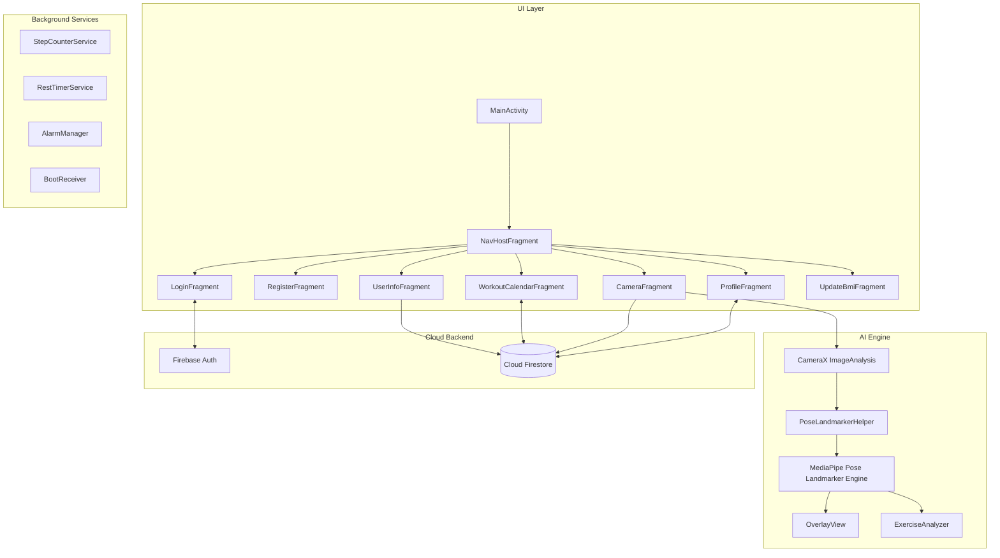

# Fitness For You

Fitness For You is a native Android fitness application designed to provide a personalized 30-day workout experience. Powered by Google MediaPipe Pose Landmarker and CameraX, the app performs real-time body movement tracking on-device, automatically counts exercise repetitions, measures posture hold times, and provides instant visual feedback.


## Table of Contents

- [Features](#features)
- [Architecture](#architecture)
- [Tech Stack](#tech-stack)
- [Project Structure](#project-structure)
- [App Flow](#app-flow)
- [Getting Started](#getting-started)
- [Firebase Configuration](#firebase-configuration)
- [Cloud Firestore Data Model](#cloud-firestore-data-model)
- [Android Permissions](#android-permissions)
- [Documentation](#documentation)
- [License](#license)

## Features

- **Authentication & Profile Setup**: Email and password authentication via Firebase Auth with automatic session persistence.
- **BMI Calculation & Categorization**: Calculates Body Mass Index (BMI) from height and weight, categorizing users into Underweight (`GAY`), Balanced (`CAN DOI`), or Overweight (`THUA CAN`).
- **Dynamic 30-Day Workout Generator**: Generates a tailored 30-day workout plan with weekly difficulty scaling and body-specific rest day intervals.
- **Real-Time AI Pose Detection**: Tracks 33 3D body joints on-device at ~30 FPS using CameraX and Google MediaPipe Pose Landmarker.
- **Repetition & Hold-Time Counting**: Automatically counts repetitions for Push-ups, Squats, Sit-ups, Jumping Jacks, and Split Squats, and tracks hold times for Plank and Side Plank.
- **Offline Tutorial Videos**: Embedded MP4 demonstration videos bundled directly within application assets.
- **5-Minute Rest Timer**: Foreground Service countdown between exercises with high-priority notifications.
- **Pedometer & Calorie Tracking**: Hardware step-sensor integration via Foreground Service calculating daily step count and estimated calorie burn.
- **Daily Reminders & Reboot Recovery**: Scheduled 8:00 AM daily workout alarm using AlarmManager and BootReceiver for device restart recovery.
- **7-Day BMI Update Prompt**: Enforces body metric updates every 7 days to keep workout plans aligned with user progress.

## Architecture

The application uses a Single Activity Architecture built with Jetpack Navigation, modular exercise analyzers, and Android Foreground Services.



## Tech Stack

| Category | Technology | Purpose |
| :--- | :--- | :--- |
| **Language** | Kotlin | Core application language |
| **Architecture** | Android Native SDK, Jetpack Navigation | Single Activity pattern & fragment navigation |
| **UI & Layouts** | XML, View Binding, Material Components | User interface design |
| **Computer Vision** | MediaPipe Tasks Vision | 33 3D body landmark detection |
| **Camera** | CameraX | Real-time camera feed analysis |
| **Backend & Auth** | Firebase Authentication & Cloud Firestore | User accounts & cloud synchronization |
| **Background Processing** | Android Foreground Services | Step counting & rest timer services |
| **System Scheduling** | AlarmManager, BroadcastReceiver | Daily reminder notifications & reboot recovery |

## Project Structure

```text
AIFitness1/
├── app/
│   ├── src/main/java/com/google/mediapipe/examples/poselandmarker/
│   │   ├── fragment/                  # App screens
│   │   ├── BaseExerciseAnalyzer.kt    # Base class for analyzers
│   │   ├── ExerciseAnalyzer.kt        # Exercise angle analysis & state machine
│   │   ├── FitnessApplication.kt      # Application initialization & seed data
│   │   ├── Models.kt                  # Data models for Firestore & UI
│   │   ├── NotificationHelper.kt      # AlarmManager notification helper
│   │   ├── OverlayView.kt             # Skeleton rendering view
│   │   ├── PoseLandmarkerHelper.kt    # MediaPipe helper wrapper
│   │   ├── RestTimerService.kt        # 5-minute rest timer service
│   │   ├── StepCounterService.kt      # Pedometer foreground service
│   │   ├── WorkoutReminderReceiver.kt # Reminder notification receiver
│   │   └── BootReceiver.kt            # Boot recovery receiver
│   ├── src/main/assets/
│   │   ├── pose_landmarker_*.task     # MediaPipe TFLite pose models
│   │   └── videos/                    # Bundled MP4 tutorial videos
│   └── src/main/res/                  # XML layouts, navigation, resources
├── docs/
│   ├── ARCHITECTURE.md                # System architecture documentation
│   └── TECHNICAL_OVERVIEW.md          # Implementation details overview
├── CONTRIBUTING.md                    # Developer contribution guidelines
├── SECURITY.md                        # Security policy
├── LICENSE                            # Apache License 2.0
└── README.md                          # Project repository homepage
```

## App Flow

1. **Application Initialization**: `FitnessApplication` initializes Firebase and seeds master exercise data.
2. **Authentication**: Users authenticate through `LoginFragment` or `RegisterFragment`.
3. **Profile Setup**: `UserInfoFragment` collects metrics, calculates BMI, and generates a 30-day plan.
4. **Workout Calendar**: Users select days and view exercises in `WorkoutCalendarFragment`.
5. **AI Motion Analysis**: `CameraFragment` processes frames via CameraX and MediaPipe, updating rep counts and Firestore data.
6. **Rest & Tracking**: `RestTimerService` handles rest periods, while `StepCounterService` tracks steps and estimated calories.

## Getting Started

### Prerequisites

- Android Studio (Hedgehog or newer)
- JDK 17
- Android Device (API level 24 or higher) with camera support
- Firebase project with Authentication and Cloud Firestore enabled

### Installation

1. Clone the repository:
   ```bash
   git clone https://github.com/truongvu-25/AIFitness1.git
   cd AIFitness1
   ```

2. Add your Firebase configuration file (`google-services.json`) to `app/google-services.json`.

3. Build the debug APK:
   ```powershell
   .\gradlew.bat assembleDebug
   ```

## Firebase Configuration

The repository does not include `google-services.json`. Place your downloaded configuration file in the following location:

```text
app/google-services.json
```

Required Firebase services:
- Email/Password Authentication
- Cloud Firestore

## Cloud Firestore Data Model

```text
exercises/{exerciseId}                 # Master exercise metadata
users/{uid}                            # User profile and health records
users/{uid}/workouts/day_{1..30}       # Daily workout plan documents
```

## Android Permissions

- `CAMERA`: Camera access for real-time pose detection.
- `INTERNET`: Network access for Firebase sync.
- `ACTIVITY_RECOGNITION`: Access to hardware step counter sensor.
- `FOREGROUND_SERVICE`: Running background pedometer and rest timer.
- `FOREGROUND_SERVICE_DATA_SYNC`: Foreground service compliance for Android 14 (API 34).
- `POST_NOTIFICATIONS`: Notification permissions on Android 13+.
- `RECEIVE_BOOT_COMPLETED`: Rescheduling reminders on reboot.
- `SCHEDULE_EXACT_ALARM`: Precise alarm scheduling.

## Documentation

- [System Architecture](docs/ARCHITECTURE.md)
- [Technical Overview](docs/TECHNICAL_OVERVIEW.md)
- [Contributing Guidelines](CONTRIBUTING.md)
- [Security Policy](SECURITY.md)

## License

This project is licensed under the Apache License 2.0. See [LICENSE](LICENSE) for details.
