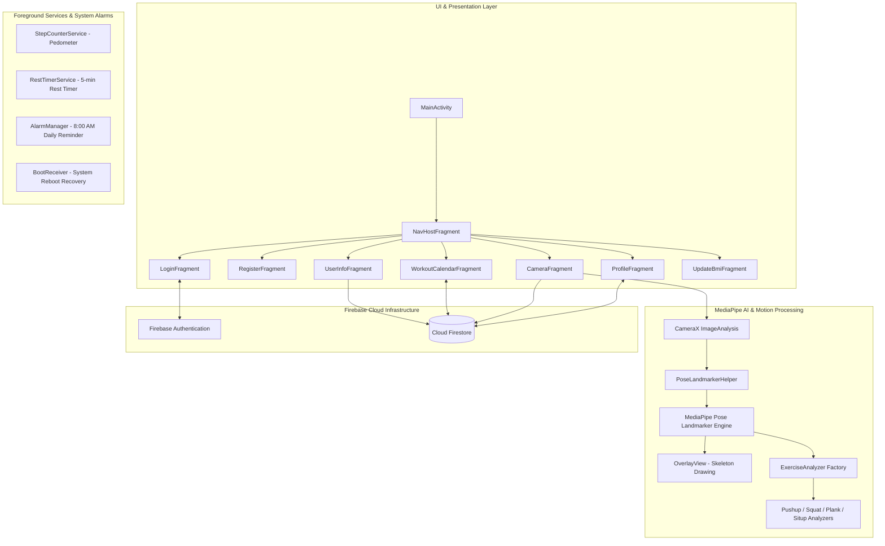

# Fitness For You - AI-Powered Personal Fitness & Workout Assistant

[](https://developer.android.com/)
[](https://kotlinlang.org/)
[](https://developers.google.com/mediapipe)
[](https://firebase.google.com/)
[](LICENSE)

**Fitness For You** is a native Android application that delivers a smart, personalized 30-day fitness experience. Powered by **Google MediaPipe Pose Landmarker** and **CameraX**, the app analyzes physical movements in real-time, counts exercise repetitions, measures posture hold times, and provides instant visual feedback—all running locally on-device.


---

## 📌 Table of Contents

- [Key Features](#-key-features)
- [System Architecture](#-system-architecture)
- [Technology Stack](#-technology-stack)
- [Project Structure](#-project-structure)
- [App Flow & Execution Pipeline](#-app-flow--execution-pipeline)
- [Getting Started & Setup](#-getting-started--setup)
- [Firebase Configuration](#-firebase-configuration)
- [Cloud Firestore Data Model](#-cloud-firestore-data-model)
- [Android Permissions](#-android-permissions)
- [Documentation Index](#-documentation-index)
- [License & Acknowledgments](#-license--acknowledgments)

---

## ✨ Key Features

- **🔐 Authentication & Profile Setup**: Secure email/password authentication via Firebase Auth with automatic session persistence.
- **📊 Smart BMI & Body Categorization**: Calculates Body Mass Index (BMI) from height/weight and categorizes users into `GAY` (Underweight), `CAN DOI` (Balanced), or `THUA CAN` (Overweight).
- **🗓️ Dynamic 30-Day Workout Generator**: Automatically generates a tailored 30-day workout plan with progressive difficulty scaling across 4 weeks and personalized rest-day intervals.
- **🤖 Real-Time AI Pose Detection**: Uses CameraX and Google MediaPipe Pose Landmarker to track 33 3D body joints on-device at ~30 FPS with real-time skeleton overlay.
- **🏋️ Rep & Hold-Time Counter**: State-machine-based analyzers automatically count reps (Push-ups, Squats, Sit-ups, Jumping Jacks, Split Squats) and measure posture hold times (Plank, Side Plank).
- **🎬 Zero-Latency Video Tutorials**: Offline MP4 video demonstration player bundled directly in app assets for instant playback.
- **⏱️ 5-Minute Rest Timer**: Foreground Service countdown between exercises with high-priority expiration notifications.
- **👟 Background Pedometer & Calorie Tracker**: Hardware step-sensor integration via Foreground Service, calculating daily step count and estimated calorie burn (`calories = steps * 0.04`).
- **⏰ Daily Reminder & Reboot Recovery**: Scheduled 8:00 AM daily workout alarm via `AlarmManager` and `BootReceiver` for seamless device restart recovery.
- **🔄 7-Day BMI Re-evaluation Prompt**: Enforces height/weight re-evaluation every 7 days to update fitness plans based on user progress.

---

## 🏗️ System Architecture

The application follows a **Single Activity Architecture** leveraging Jetpack Navigation Component, modular AI analysis engines, and resilient Android Foreground Services.



---

## 🛠️ Technology Stack

| Category | Technology / Library | Purpose |
| :--- | :--- | :--- |
| **Language** | Kotlin 1.9+ | Primary programming language |
| **Core Architecture** | Android Native SDK, Jetpack Navigation | Single Activity pattern & fragment routing |
| **UI & Layouts** | XML, View Binding, Material Components | Custom UI components & responsive screens |
| **Computer Vision / AI** | MediaPipe Tasks Vision (`0.10.14`) | 33 3D body landmark detection & tracking |
| **Camera Feed** | CameraX (`1.3.4`) | High-performance real-time camera stream |
| **Backend & Auth** | Firebase Auth & Cloud Firestore | User management & cloud database sync |
| **Background Processing**| Android Foreground Services | Step counting & 5-minute rest countdown |
| **System Scheduling** | `AlarmManager`, `BroadcastReceiver` | Daily reminders & reboot recovery |

---

## 📁 Project Structure

```text
AIFitness1/
├── app/
│   ├── src/main/java/com/google/mediapipe/examples/poselandmarker/
│   │   ├── fragment/                  # App screens (Login, Profile, Camera, Calendar, etc.)
│   │   │   ├── CameraFragment.kt      # CameraX & AI workout screen
│   │   │   ├── LoginFragment.kt       # Auth & session routing
│   │   │   ├── ProfileFragment.kt     # Profile, pedometer & health tips
│   │   │   ├── RegisterFragment.kt    # Account registration
│   │   │   ├── UpdateBmiFragment.kt   # 7-day BMI update screen
│   │   │   ├── UserInfoFragment.kt    # Body metrics survey & plan generation
│   │   │   └── WorkoutCalendarFragment.kt # 30-day workout calendar UI
│   │   ├── BaseExerciseAnalyzer.kt    # Base class for exercise analyzers
│   │   ├── ExerciseAnalyzer.kt        # Exercise analysis & rep counting state machines
│   │   ├── FitnessApplication.kt      # Application class & seed data initialization
│   │   ├── Models.kt                  # Data models for Firestore & UI
│   │   ├── NotificationHelper.kt      # AlarmManager daily reminder helper
│   │   ├── OverlayView.kt             # Custom view drawing 33 landmark skeleton
│   │   ├── PoseLandmarkerHelper.kt    # MediaPipe Pose Landmarker configuration wrapper
│   │   ├── RestTimerService.kt        # Foreground Service for 5-min rest countdown
│   │   ├── StepCounterService.kt      # Foreground Service for step & calorie tracking
│   │   ├── WorkoutReminderReceiver.kt # BroadcastReceiver for 8:00 AM alarm
│   │   └── BootReceiver.kt            # Restores alarm after device reboot
│   ├── src/main/assets/
│   │   ├── pose_landmarker_*.task     # MediaPipe pose detection TFLite model bundles
│   │   └── videos/                    # Bundled offline MP4 tutorial videos
│   └── src/main/res/                  # XML layouts, navigation graph, drawables, values
├── docs/
│   ├── ARCHITECTURE.md                # System architecture & component documentation
│   └── TECHNICAL_OVERVIEW.md          # Technical overview for reviewers & engineers
├── CONTRIBUTING.md                    # Guidelines for contributing to the repository
├── SECURITY.md                        # Security policy & data privacy instructions
├── LICENSE                            # Apache License 2.0
└── README.md                          # Project documentation homepage
```

---

## 🔄 App Flow & Execution Pipeline

```text
1. Application Launch (FitnessApplication)
   └── Initialize Firebase & Seed 'exercises' collection on Cloud Firestore.
   
2. Entry & Authentication (LoginFragment / RegisterFragment)
   ├── Authenticate via Firebase Auth.
   └── Check 7-day BMI status (Route to UpdateBmiFragment if expired).

3. Profile & Plan Generation (UserInfoFragment)
   ├── Calculate BMI & classify body type (GAY / CAN DOI / THUA CAN).
   └── Generate 30-day workout plan via Firestore Batch Write.

4. Workout Execution (WorkoutCalendarFragment)
   ├── View 30-day interactive calendar (6 color-coded day states).
   ├── Watch offline MP4 tutorial video popup.
   └── Launch Camera AI mode (CameraFragment).

5. AI Motion Analysis (CameraFragment & ExerciseAnalyzer)
   ├── CameraX feeds live frames (~30 FPS) to MediaPipe Pose Landmarker.
   ├── OverlayView draws 33 skeleton joints in real-time.
   ├── ExerciseAnalyzer calculates joint angles (e.g., elbow, knee, hip).
   └── Auto-count reps or seconds; update Firestore upon target completion.

6. Post-Workout & Background Services
   ├── Trigger 5-minute rest countdown (RestTimerService).
   └── Track daily step count & calories in background (StepCounterService).
```

---

## 🚀 Getting Started & Setup

### Prerequisites

- **Android Studio**: Hedgehog (2023.1.1) or newer.
- **JDK**: Java 17 (configured via Android Studio or `JAVA_HOME`).
- **Android Device**: Physical device recommended (API level 24 / Android 7.0 or higher) with a working camera and step counter sensor.
- **Firebase Account**: A Firebase project with **Authentication** and **Cloud Firestore** enabled.

### Installation Steps

1. **Clone the repository**:
   ```bash
   git clone https://github.com/truongvu-25/AIFitness1.git
   cd AIFitness1
   ```

2. **Add Firebase Configuration**:
   Follow the [Firebase Configuration](#-firebase-configuration) section below to place `google-services.json` in `app/`.

3. **Build the Debug APK**:
   ```bash
   # On Windows (PowerShell)
   .\gradlew.bat assembleDebug

   # On macOS / Linux
   ./gradlew assembleDebug
   ```

4. **Run on Device**:
   Open the project in Android Studio, sync Gradle, connect your Android device via USB debugging, and click **Run 'app'**.

---

## 🔥 Firebase Configuration

For security and privacy reasons, the repository does **not** track private `google-services.json` or Firebase API keys.

To connect your own Firebase project:

1. Go to the [Firebase Console](https://console.firebase.google.com/).
2. Create a new Firebase project (e.g., `fitness-for-you`).
3. Add an **Android app** with package name: `com.google.mediapipe.examples.poselandmarker`.
4. Download `google-services.json` and place it at the following path:
   ```text
   AIFitness1/app/google-services.json
   ```
5. In Firebase Console:
   - Enable **Authentication** ➔ Sign-in method ➔ **Email/Password**.
   - Enable **Cloud Firestore** ➔ Create database in Test Mode or configure rules.

---

## 🗄️ Cloud Firestore Data Model

The app uses Cloud Firestore structured as follows:

```text
exercises/{exerciseId}                 # Master static exercise metadata
users/{uid}                            # User profile & BMI record
users/{uid}/workouts/day_{1..30}       # Individual workout plan days
```

### Document Schemas

- **`exercises/{exerciseId}`**: `id`, `name`, `description`, `videoUrl`, `isTimed`, `unit`
- **`users/{uid}`**: `fullName`, `age`, `height`, `weight`, `bmi`, `bmiType`, `createdTime`, `lastBmiUpdatedTime`
- **`users/{uid}/workouts/day_{dayIndex}`**: `dayIndex`, `isRestDay`, `exercises`: list of `{exerciseId, targetCount, status}`

---

## 🔒 Android Permissions

The app declares and manages the following runtime & system permissions:

| Permission | Purpose |
| :--- | :--- |
| `android.permission.CAMERA` | Real-time camera feed for MediaPipe AI pose detection |
| `android.permission.INTERNET` | Firebase Authentication & Cloud Firestore data sync |
| `android.permission.ACTIVITY_RECOGNITION` | Hardware step counter sensor access |
| `android.permission.FOREGROUND_SERVICE` | Running step counter & rest timer background services |
| `android.permission.FOREGROUND_SERVICE_DATA_SYNC` | Android 14 (API 34) compliant background service execution |
| `android.permission.POST_NOTIFICATIONS` | Notifications on Android 13+ (API 33+) |
| `android.permission.RECEIVE_BOOT_COMPLETED` | Restoring 8:00 AM daily workout alarm on reboot |
| `android.permission.SCHEDULE_EXACT_ALARM` | Scheduling precise daily workout reminders |

---

## 📖 Documentation Index

- 📑 [System Architecture Overview](docs/ARCHITECTURE.md) - Deep dive into UI layer, AI pipeline, services, and security.
- 📑 [Technical Overview](docs/TECHNICAL_OVERVIEW.md) - Comprehensive technical guide for code reviewers & engineers.
- 🤝 [Contributing Guidelines](CONTRIBUTING.md) - Guidelines for contributing, adding new exercises, and code standards.
- 🛡️ [Security Policy](SECURITY.md) - Data privacy guidelines and security vulnerability reporting.

---

## 📄 License & Acknowledgments

This project is open-source software licensed under the **[Apache License 2.0](LICENSE)**.

### Acknowledgments
- Based on the [Google MediaPipe Android Pose Landmarker Sample](https://github.com/google-ai-edge/mediapipe-samples).
- Uses Google MediaPipe Tasks Vision SDK and Android Jetpack libraries.
