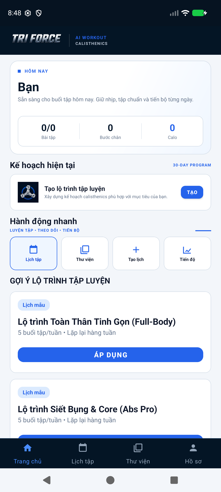
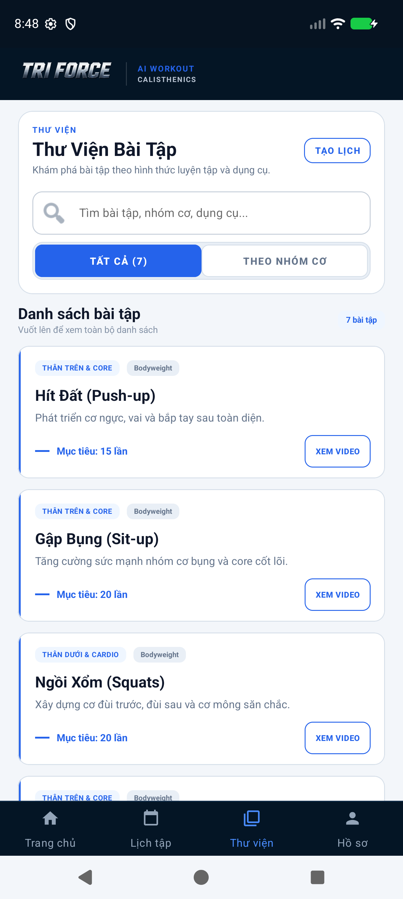
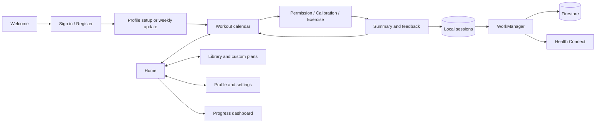

<p align="center"></p>

# TRI FORCE

**An Android fitness companion with on-device pose tracking, personalized plans and offline workout recording.**

[](https://github.com/truongvu-25/AIFitness1/actions/workflows/android.yml)
[](LICENSE)


TRI FORCE helps users follow a 30-day routine, watch bundled demonstrations, count exercise repetitions or holds through the camera, and review progress. MediaPipe processes camera frames locally. Firebase provides authentication and cloud persistence; Room and WorkManager preserve workout results when connectivity is unavailable.

The repository name and Android application ID retain their original names for compatibility. The product name is **TRI FORCE**, previously Fitness For You.

## Features

- Email/password authentication, conversational profile setup and weekly metric updates.
- Personalized 30-day schedules, exercise library and custom weekly plan templates.
- Pose analysis for push-ups, squats, sit-ups, jumping jacks, split squats, plank and side plank.
- Camera calibration, skeleton overlay and optional device text-to-speech coaching.
- Workout summaries, form feedback, difficulty ratings and suggested future targets.
- Local workout recording with retryable, idempotent cloud synchronization.
- Progress dashboard, hardware step counter, five-minute rest timer and configurable reminders.
- Optional Health Connect step reads and workout writes.
- Vietnamese and English resources; some runtime coaching and screen text remains Vietnamese.

Pose accuracy and inference speed depend on hardware, model, lighting, framing and movement. Custom library entries do not automatically gain a pose analyzer.

## Screenshots

<p align="center">
  
  
</p>

Screens captured on an Android emulator with empty account data.

## App flow



## Build and run

| Component | Requirement |
| --- | --- |
| Device | Android 8.0 / API 26+, camera |
| SDK | Compile SDK 36, target SDK 34 |
| Java | JDK 17 recommended; local audit also used JDK 21 |
| Gradle | 8.14.3, supplied by the wrapper |
| Android Gradle Plugin | 8.11.0 |
| Kotlin | 2.0.21 |

Use Android Studio compatible with AGP 8.11 and install the required SDK. Validate camera/sensors on a physical device before distribution.

```bash
git clone https://github.com/truongvu-25/AIFitness1.git
cd AIFitness1
```

1. Create a Firebase project and register package `com.google.mediapipe.examples.poselandmarker`.
2. Enable Email/Password Authentication and create Cloud Firestore.
3. Download configuration to `app/google-services.json` (ignored by Git).
4. Configure the Android SDK through Android Studio or local `local.properties`; set `JAVA_HOME` to your JDK.
5. Build/install:

```powershell
# Windows
.\gradlew.bat assembleDebug installDebug
```

```bash
# macOS / Linux
chmod +x gradlew
./gradlew assembleDebug installDebug
```

APK output: `app/build/outputs/apk/debug/app-debug.apk`. Models and tutorial videos are bundled. Gradle downloads missing models from Google's model storage; the initial dependency download needs internet access.

For build-only checks, copy `app/google-services.example.json` to `app/google-services.json`. The example contains fake identifiers: authentication and cloud features cannot work with it. CI uses this configuration and needs no production secrets.

## Verification

```powershell
.\gradlew.bat testDebugUnitTest lintDebug assembleDebug assembleRelease
# With a connected emulator/device:
.\gradlew.bat connectedDebugAndroidTest
```

Release output is an **unsigned** APK. Configure signing outside version control before distribution. CI runs build, JVM tests and lint; device tests run separately. See [testing](docs/TESTING.md) and the [audit record](docs/FINAL_AUDIT.md) for verified scope and remaining checks.

## Structure

```text
app/src/main/java/com/google/mediapipe/examples/poselandmarker/
  analysis/       Pose engine, overlay and exercise analyzers
  data/           Room storage and background synchronization
  health/         Health Connect integration
  model/          Profiles, workouts and progression logic
  notification/   Reminder scheduling
  receiver/       Alarm and reboot handling
  service/        Step counter and rest timer
  ui/fragment/    Onboarding, home, library, camera and profile
  voice/          Device speech coaching
app/src/main/assets/     Pose models and tutorial videos
app/src/main/res/        Layouts, navigation, styles and translations
app/src/test/            JVM regression tests
app/src/androidTest/     Room, navigation and MediaPipe device tests
docs/                    Architecture, setup and validation
.github/                 CI and contributor templates
```

## Documentation

- [Architecture](docs/ARCHITECTURE.md) and [implementation overview](docs/TECHNICAL_OVERVIEW.md)
- [Firebase setup](docs/FIREBASE.md)
- [Testing](docs/TESTING.md) and [final audit](docs/FINAL_AUDIT.md)
- [Contributing](CONTRIBUTING.md), [security](SECURITY.md) and [changelog](CHANGELOG.md)

## Attribution and license

Source code is distributed under [Apache License 2.0](LICENSE). The project builds on Google's [MediaPipe Android pose-landmarker example](https://github.com/google-ai-edge/mediapipe-samples/tree/main/examples/pose_landmarker/android); original copyright notices are retained. Third-party dependencies and models retain their respective licenses. Confirm distribution rights for bundled demonstration videos and branding before an app-store release.
