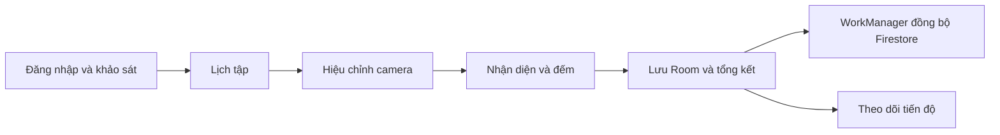

<p align="center">
  
</p>

<h1 align="center">Tri Force</h1>

<p align="center"><strong>Sức Mạnh • Kỷ Luật • Bứt Phá</strong><br>
Ứng dụng Android hỗ trợ tập luyện bằng camera, lộ trình cá nhân và theo dõi tiến độ.</p>

<p align="center"><a href="README.md">English</a> · <a href="docs/SETUP.md">Cài đặt</a> · <a href="docs/ARCHITECTURE.md">Kiến trúc</a></p>

Tri Force sử dụng CameraX và MediaPipe Pose Landmarker để nhận diện chuyển động ngay trên điện thoại, đếm số lần thực hiện và theo dõi thời gian giữ tư thế. App kết hợp khảo sát thể trạng, lịch tập 30 ngày, thư viện bài tập và báo cáo sau mỗi buổi tập.

Tên và logo trong trang này lấy từ ứng dụng hiện tại. Repository có tên `AIFitness1`, còn tên app là **Tri Force**.

## Tính năng

- **Tài khoản và hồ sơ:** đăng ký/đăng nhập bằng email, khảo sát theo luồng hội thoại, cập nhật chiều cao, cân nặng, mục tiêu và trình độ.
- **Lịch tập:** tạo lộ trình 30 ngày từ thông tin hồ sơ, chọn một trong ba giáo án mẫu hoặc tự xây dựng lịch theo tuần.
- **Tập bằng camera:** hiệu chỉnh tư thế ban đầu, đếm lần hoặc giây, hiển thị phản hồi tư thế và hướng dẫn giọng nói tiếng Việt.
- **Thư viện:** tìm kiếm, lọc nhóm bài tập và xem bảy video hướng dẫn được đóng gói sẵn trong app.
- **Tổng kết buổi tập:** số lần thực tế/mục tiêu, thời lượng, điểm form theo quy tắc của app, phản hồi thường gặp và so sánh kết quả.
- **Tiến độ:** lịch sử, hoạt động theo tuần, mục tiêu, chuỗi ngày tập, thành tích và thống kê từng bài.
- **Điều chỉnh mục tiêu:** đề xuất theo kết quả và độ khó do người dùng đánh giá; có thể áp dụng cho những buổi sắp tới.
- **Lưu kết quả trên máy:** Room lưu buổi tập trước khi WorkManager đồng bộ lên Firestore.
- **Bước chân và nhắc tập:** cảm biến bước chân, calo ước tính, Health Connect tùy chọn, giờ nhắc tập tùy chỉnh và bộ đếm nghỉ năm phút.
- **Ngôn ngữ:** có tài nguyên tiếng Việt/tiếng Anh và nút đổi ngôn ngữ ở màn chào. Một số nội dung camera, giọng nói và tổng kết vẫn dùng tiếng Việt.

## Bài tập được hỗ trợ

| Bài tập | ID | Cách đếm |
| --- | --- | --- |
| Hít đất | `pushup` | Số lần |
| Gập bụng | `situp` | Số lần |
| Squat | `squat` | Số lần |
| Plank | `plank` | Số giây |
| Side plank | `sideplank` | Số giây |
| Jumping jack | `jumpingjack` | Số lần |
| Split squat | `splitsquat` | Số lần |

## Chạy project

Cần JDK 17 hoặc phiên bản mới hơn tương thích, Android SDK Platform 36 và thiết bị Android 8.0/API 26 trở lên có camera. Project dùng Gradle 8.14.3, AGP 8.11.0, Kotlin 2.0.21; `targetSdk` hiện là 34.

1. Clone repository:

   ```bash
   git clone https://github.com/truongvu-25/AIFitness1.git
   cd AIFitness1
   ```

2. Tạo Firebase project riêng, thêm Android app với package `com.google.mediapipe.examples.poselandmarker`, bật Email/Password Authentication và tạo Cloud Firestore.

3. Tải cấu hình Firebase về `app/google-services.json` và thiết lập quyền truy cập theo [hướng dẫn Firebase](docs/SETUP.md#firebase). File cấu hình thật được Git bỏ qua. File `.example` chỉ dùng kiểm tra build, không dùng đăng nhập.

4. Mở project trong Android Studio hỗ trợ AGP 8.11, chọn SDK/JDK rồi sync Gradle. Nếu dùng dòng lệnh, khai báo `JAVA_HOME` và đường dẫn Android SDK.

5. Build và chạy unit test:

   ```powershell
   .\gradlew.bat :app:assembleDebug :app:testDebugUnitTest
   ```

   Trên macOS/Linux:

   ```bash
   bash ./gradlew :app:assembleDebug :app:testDebugUnitTest
   ```

APK nằm tại `app/build/outputs/apk/debug/app-debug.apk`. Repository chứa ba model nhận diện và bảy video, tổng dung lượng assets khoảng 242,5 MB. Lần build đầu cần mạng để tải dependency; Gradle tải lại model nếu file model bị thiếu.

Xem [SETUP.md](docs/SETUP.md) để biết cách kiểm tra lint, kiểm tra trên thiết bị và xử lý lỗi cấu hình.

## Cách hoạt động



Phần nhận diện dùng MediaPipe trên thiết bị; bộ phân tích bài tập dùng góc khớp và trạng thái chuyển động. Hội thoại khảo sát, giáo án và đề xuất mục tiêu dùng câu hỏi/quy tắc có sẵn trong mã nguồn.

Kết quả camera được lưu trên máy rồi đồng bộ. Tài khoản, hồ sơ, giáo án và lịch sử được lưu trên Firebase. Health Connect đọc số bước và ghi buổi tập khi người dùng cấp quyền. Đường xử lý camera hiện tại không tải khung hình lên Firebase.

Tốc độ và chất lượng nhận diện phụ thuộc thiết bị, ánh sáng, góc quay và việc cơ thể có nằm đủ trong khung hình hay không. Điểm form là chỉ số ước lượng của app. Đăng ký, đăng nhập và các thao tác phụ thuộc cloud cần mạng; khả năng offline hiện tập trung vào lưu kết quả, video đóng gói sẵn và dữ liệu cache.

## Tài liệu

- [Kiến trúc và mô hình dữ liệu](docs/ARCHITECTURE.md)
- [Chi tiết triển khai](docs/TECHNICAL_OVERVIEW.md)
- [Hướng dẫn đóng góp](CONTRIBUTING.md)
- [Bảo mật](SECURITY.md)
- [Ghi chú trước khi public](docs/PUBLISHING.md)
- [Nguồn thư viện và tài nguyên](THIRD_PARTY_NOTICES.md)

Repository giữ [Apache License 2.0](LICENSE) cùng các thông báo bản quyền TensorFlow Authors từ mã nguồn MediaPipe ban đầu. Tình trạng ghi nhận nguồn logo/video được nêu trong tài liệu tài nguyên.
