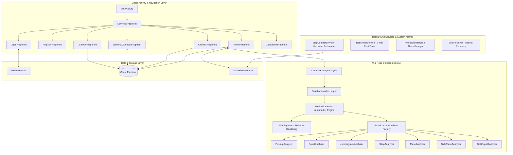

# System Architecture & Technical Specifications

This document details the architectural design, software patterns, data flow, and technical component specifications of Fitness For You.

## Architectural Overview

Fitness For You is engineered using Modern Android Development practices. It adopts a Single Activity Architecture paired with Jetpack Navigation Component, a decoupled Computer Vision engine (MediaPipe Tasks Vision + CameraX), and Android Foreground Services for continuous background operations.



## UI & Presentation Layer

The user interface uses a single hosting `MainActivity` containing a `NavHostFragment`. Top-level navigation bar (`BottomNavigationView`) visibility is managed dynamically via `navController.addOnDestinationChangedListener`.

### Fragment Breakdown

| Fragment | Class File | XML Layout | Primary Responsibility |
| :--- | :--- | :--- | :--- |
| **Login** | `LoginFragment.kt` | `fragment_login.xml` | User sign-in, auto-login persistence check, and 7-day BMI expiry routing. |
| **Register** | `RegisterFragment.kt` | `fragment_register.xml` | New account registration via Firebase Auth. |
| **User Info** | `UserInfoFragment.kt` | `fragment_user_info.xml` | Health metrics survey (height, weight, age), BMI calculation, and 30-day plan generation. |
| **Workout Calendar** | `WorkoutCalendarFragment.kt` | `fragment_workout_calendar.xml` | Interactive 30-day calendar with 6 color-coded states, tutorial popup, and workout selection. |
| **Camera AI** | `CameraFragment.kt` | `fragment_camera.xml` | Real-time CameraX preview, pose detection overlay, rep counting, and exercise completion. |
| **Profile** | `ProfileFragment.kt` | `fragment_profile.xml` | Step counter & calorie view, profile editing, and 6 AI health advice scenarios based on BMI. |
| **Update BMI** | `UpdateBmiFragment.kt` | `fragment_update_bmi.xml` | Mandatory screen enforcing height/weight updates every 7 days. |

## AI Pose Detection & Motion Analysis Engine

The computer vision engine separates image acquisition, landmark extraction, visual overlay, and exercise analysis into clean, modular layers.

```text
CameraX ImageAnalysis Stream (~30 FPS)
  └─► CameraFragment.detectPose(imageProxy)
        └─► PoseLandmarkerHelper.detectLiveStream()
              └─► MediaPipe Pose Landmarker Engine (33 3D landmarks)
                    ├─► OverlayView.setResults() -> Draw Skeleton Lines & Joints
                    └─► BaseExerciseAnalyzer.analyze(landmarks) -> Joint Angle Calculation & Rep Counter
```

### Motion Analysis & Joint Angle Trigonometry

The `BaseExerciseAnalyzer` calculates 2D/3D joint angles using 2D/3D Euclidean coordinates and 2-argument arctangent trigonometry (`Math.atan2`):

$$\theta = \left| \text{atan2}(y_C - y_B, x_C - x_B) - \text{atan2}(y_A - y_B, x_A - x_B) \right| \times \frac{180}{\pi}$$

#### Exercise Analyzer State Machines

| Exercise | Key Landmarks | Analysis Metric | State Machine Logic |
| :--- | :--- | :--- | :--- |
| **Push-up** | Shoulder, Elbow, Wrist | Elbow Angle | `DOWN` when angle $\le 90^\circ$; `UP` (increment rep) when angle $\ge 160^\circ$. |
| **Squat** | Hip, Knee, Ankle | Knee Angle | `DOWN` when angle $\le 95^\circ$; `UP` (increment rep) when angle $\ge 160^\circ$. |
| **Jumping Jack** | Wrist, Hip, Ankle | Arm & Leg Separation | `OPEN` when hands above head and feet wide; `CLOSED` (increment rep) when hands down and feet together. |
| **Sit-up** | Shoulder, Hip, Knee | Hip Angle | `DOWN` when angle $\ge 140^\circ$; `UP` (increment rep) when angle $\le 65^\circ$. |
| **Plank** | Shoulder, Hip, Ankle | Spine/Hip Straightness | Valid hold time increments per second ($1000\text{ ms}$) when hip angle is between $160^\circ - 180^\circ$. |
| **Side Plank** | Shoulder, Hip, Ankle | Lateral Hip Elevation | Valid hold time increments per second when lateral hip alignment is straight. |
| **Split Squat** | Hip, Front Knee, Ankle | Front Knee Angle | `DOWN` when front knee $\le 95^\circ$; `UP` (increment rep) when front knee $\ge 160^\circ$. |

## Background Services & System Architecture

Continuous background operations are implemented using Android Foreground Services to ensure they are not terminated by the OS when the app goes into the background.

```text
                        ┌───────────────────────────────┐
                        │        Android System         │
                        └───────────────┬───────────────┘
                                        │
                 ┌──────────────────────┴──────────────────────┐
                 │                                             │
                 ▼                                             ▼
     ┌──────────────────────┐                      ┌──────────────────────┐
     │  StepCounterService  │                      │   RestTimerService   │
     │  (Foreground Data)   │                      │  (Foreground Timer)  │
     └───────────┬──────────┘                      └───────────┬──────────┘
                 │                                             │
                 ▼                                             ▼
     Hardware Step Sensor                           5-Minute CountDownTimer
     (Sensor.TYPE_STEP_COUNTER)                     (Ongoing Notification)
                 │                                             │
                 ▼                                             ▼
     Save SharedPreferences                         Send Rest Expired Notification
     & Broadcast to Profile UI                      (Priority High Alarm)
```

### Service Specifications

1. **`StepCounterService.kt`**
   - **Type**: `foregroundServiceType="dataSync"`
   - **Sensor**: `Sensor.TYPE_STEP_COUNTER`
   - **Calorie Formula**: $\text{Calories} = \text{Steps} \times 0.04\text{ kcal}$
   - **Persistence**: Saved to `SharedPreferences`; broadcasts updates to `ProfileFragment`.

2. **`RestTimerService.kt`**
   - **Type**: `foregroundServiceType="dataSync"`
   - **Timer**: 5-minute countdown ($300,000\text{ ms}$)
   - **Behavior**: Displays ongoing live notification (`mm:ss`). Upon completion, triggers a high-priority alert notification prompting the user to start the next exercise. Auto-stops if all today's exercises are finished.

3. **`NotificationHelper.kt` & `WorkoutReminderReceiver.kt`**
   - **Mechanism**: `AlarmManager.setAndAllowWhileIdle()`
   - **Schedule**: Daily at 8:00 AM.
   - **Behavior**: Checks if today has pending exercises (`status == 0`) before delivering the notification.

4. **`BootReceiver.kt`**
   - **Trigger**: `Intent.ACTION_BOOT_COMPLETED`
   - **Behavior**: Reschedules the 8:00 AM `AlarmManager` reminder automatically after device restarts.

## Database & Data Layer Architecture

The database layer utilizes Cloud Firestore structured as a hierarchical Document-Collection model.

```text
cloud_firestore/
├── exercises/ (Collection)
│   ├── pushup (Document)
│   ├── squat (Document)
│   └── ... (7 master exercise metadata documents)
└── users/ (Collection)
    └── {uid} (Document - UserProfile)
        └── workouts/ (Sub-collection)
            ├── day_1 (Document - WorkoutDay)
            ├── day_2 (Document - WorkoutDay)
            └── ... (day_1 to day_30 documents)
```

### Data Seeding & Initialization

On application startup (`FitnessApplication.kt`), master exercise metadata is written to the `exercises` collection via a Firestore Write Batch if missing, ensuring complete self-healing capabilities when deployed to a new Firebase environment.

## Security & Android 14 Compliance

- **API 34 (Android 14) Compliance**: Foreground services declare `foregroundServiceType="dataSync"` in `AndroidManifest.xml` alongside `<uses-permission android:name="android.permission.FOREGROUND_SERVICE_DATA_SYNC" />`.
- **Sensitive Data Exclusion**: Local configuration files (`google-services.json`, `local.properties`, keystores) are excluded from source control via `.gitignore`.
