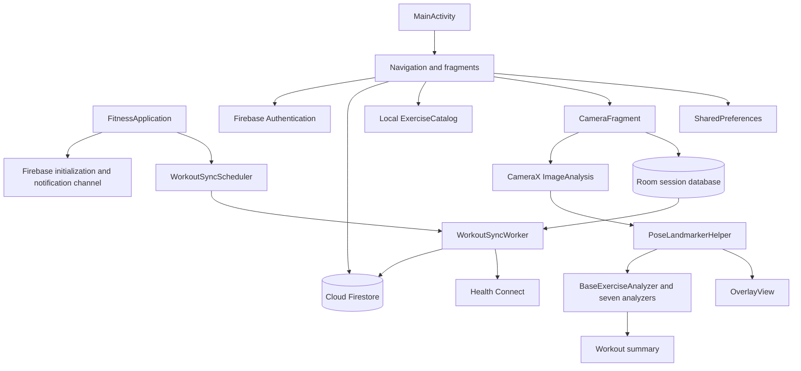

# Tri Force architecture

[Repository overview](../README.md) · [Setup](SETUP.md) · [Implementation](TECHNICAL_OVERVIEW.md)

## Application structure

Tri Force is a single-module Android app. `MainActivity` hosts a Jetpack Navigation graph and shows the shared header/bottom navigation on Home, Calendar, Library, and Profile. Screens use XML layouts and View Binding. Much of the UI and Firestore access lives directly in fragments; `MainViewModel` holds shared pose inference settings.



## Component map

Source paths below are relative to `app/src/main/java/com/google/mediapipe/examples/poselandmarker/`.

| Component | Responsibility |
| --- | --- |
| `FitnessApplication.kt` | Locale attachment, Firebase initialization, notification channel, sync scheduling |
| `MainActivity.kt` | Navigation host, shared app chrome, activity/notification permission requests |
| `ui/fragment/onboarding/` | Welcome/language selection, email registration/login, camera permission flow |
| `ui/fragment/profile/UserInfoFragment.kt` | Guided profile questionnaire, profile edits, initial 30-day plan |
| `ui/fragment/profile/chat/` | Question definitions, answer state, chat rows, height picker |
| `ui/fragment/profile/UpdateBmiFragment.kt` | Height/weight and BMI update |
| `ui/fragment/profile/ProfileFragment.kt` | Profile, steps, reminder preferences, Health Connect, logout |
| `ui/fragment/home/HomeFragment.kt` | Home dashboard, saved/preset/custom plans, plan activation |
| `ui/fragment/home/WorkoutCalendarFragment.kt` | Calendar states, daily exercises, plan management, tutorials |
| `ui/fragment/home/ProgressFragment.kt` | Session history, weekly goal/chart, streaks, achievements |
| `ui/fragment/library/` | Search/filter exercises and construct a custom weekly plan |
| `ui/fragment/camera/CameraFragment.kt` | Camera lifecycle, calibration, voice guidance, session capture |
| `ui/fragment/camera/WorkoutSummaryFragment.kt` | Result display, difficulty feedback, target adjustment |
| `ui/fragment/camera/GalleryFragment.kt` | MediaPipe image/video analysis from selected media |
| `analysis/` | Pose helper, overlay, exercise state machines |
| `model/` | Catalog, Firestore/UI models, progression rules |
| `data/local/` | Room database, session entity, DAO |
| `data/WorkoutSyncWorker.kt` | Pending-session upload and optional Health Connect writes |
| `health/HealthConnectManager.kt` | Permission checks, steps aggregation, exercise records |
| `service/`, `notification/`, `receiver/` | Step tracking, rest countdown, reminders, boot recovery |
| `utils/LocaleHelper.kt` | Persisted language and localized contexts |

## Data storage

### Firebase

Firebase Authentication handles email/password credentials. Firestore stores application data under the authenticated user's UID:

```text
users/{uid}
  profile fields, active plan metadata, weekly goal
  workouts/day_{1..30}
    dayIndex, exercises[], isRestDay / restDay
  custom_plans/{planId}
    saved weekly plan
  workout_sessions/{sessionId}
    exercise, target, actual count, duration, form feedback, difficulty, timestamps
  exercise_history/{exerciseId}
    last result, last difficulty, last completion time, session count
```

The seven exercise definitions and preset plans come from `ExerciseCatalog`. Startup does not seed a global `exercises` collection. Some data-model comments still refer to the earlier cloud catalog.

Firestore access rules must enforce UID ownership. A rule example is included in [setup](SETUP.md#firebase); no Firebase project or deployed rules are bundled with this repository.

### Room and synchronization

`TriForceDatabase` uses `tri_force_offline.db`, schema version 1. `PendingWorkoutSessionEntity` stores the owning UID, session metrics, JSON-encoded feedback, difficulty, separate Firestore/Health Connect sync flags, and the last cloud sync error.

1. Camera completion writes a session to Room.
2. The app requests unique WorkManager work with a connected-network constraint.
3. The worker selects pending sessions for the currently authenticated UID.
4. A Firestore transaction writes the session, marks matching daily exercises complete, and updates per-exercise history.
5. With Health Connect availability and permissions, the worker writes an exercise session using a stable client record ID.
6. Sync flags are updated independently. Failures use exponential backoff, with a retry cap in the worker.

Sync is also requested during application initialization and after difficulty feedback changes. The worker's `KEEP` policy, network constraint, retry cap, and current-account filtering are relevant when debugging delayed uploads. Local persistence does not make every screen or account operation available offline.

### Preferences and device data

SharedPreferences hold language, reminder time/enabled state, step counter state, voice mode, and some plan/goal caches. Profile step display can incorporate Health Connect data. The step service estimates calories as `steps * 0.04`.

The camera pipeline processes frames in memory on-device and stores workout metrics. It has no camera-frame upload path to Firebase. Android TextToSpeech behavior depends on the installed speech engine and voice data.

Health Connect access is limited to reading steps and writing exercise sessions. It is optional, checked at runtime, and separately permissioned. The sync worker currently requires both declared Health Connect permissions before writing a session.

## Permissions and background work

| Manifest capability | Used for |
| --- | --- |
| Camera and required camera hardware | Live pose inference |
| Internet | Authentication, Firestore, dependencies on remote services |
| Activity recognition | Hardware step sensor |
| Post notifications | Workout reminders and service notifications |
| Foreground service + health type | StepCounterService |
| Foreground service + dataSync type | RestTimerService |
| Receive boot completed | Restore reminder scheduling |
| Health read steps / write exercise | Optional Health Connect integration |

Reminders default to 08:00, can be changed in Profile, and use `setAndAllowWhileIdle`. The manifest does not request an exact-alarm permission. The rest timer lasts five minutes. Android scheduling and device power management can affect delivery.

## Branding and localization

The app label resolves to **Tri Force** in both language resource sets. `AndroidManifest.xml` uses `res/drawable/app_logo.png` for the app icon and round icon; both READMEs reference that same file. Existing welcome and in-app brand assets remain in `res/drawable/`.

The default locale is Vietnamese, with English resource overrides. Several camera, summary, and voice strings are still hardcoded Vietnamese. The Kotlin namespace and application ID preserve the original MediaPipe sample package.

